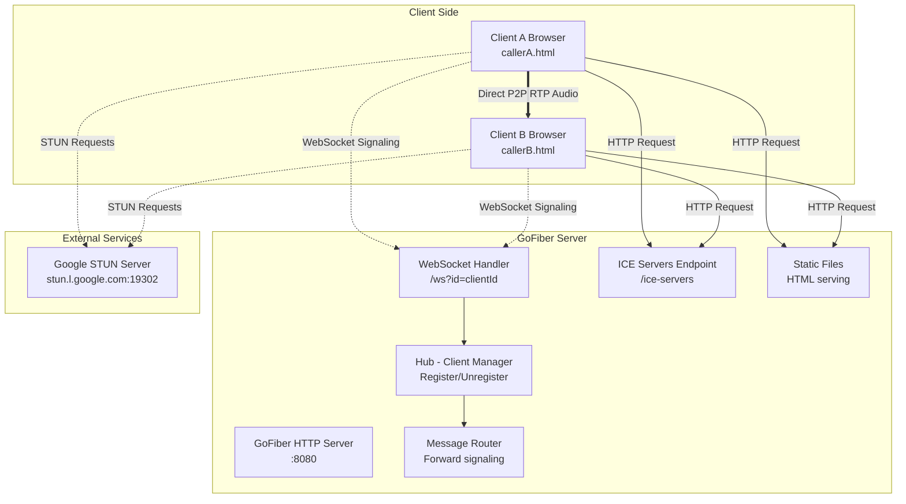
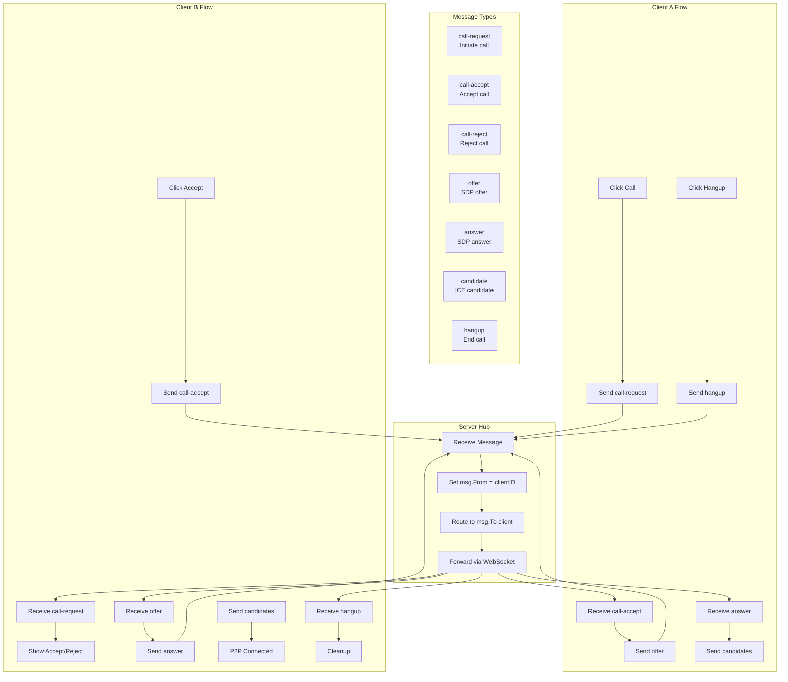
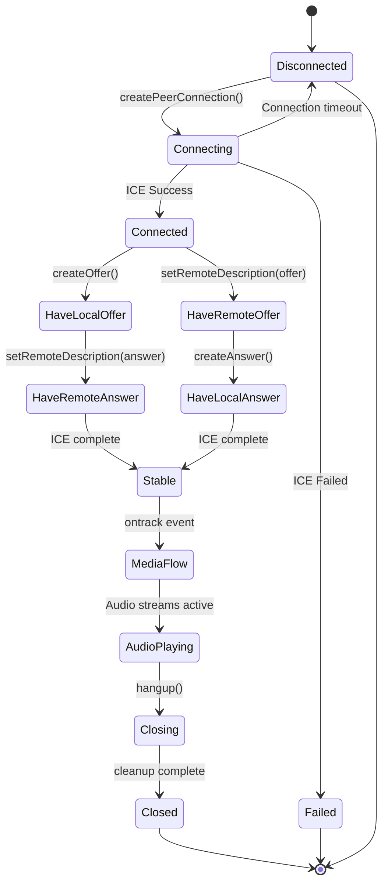
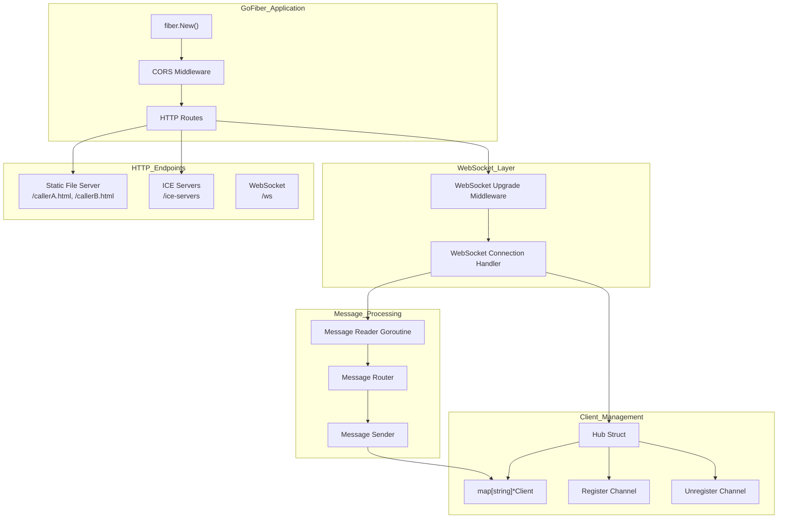
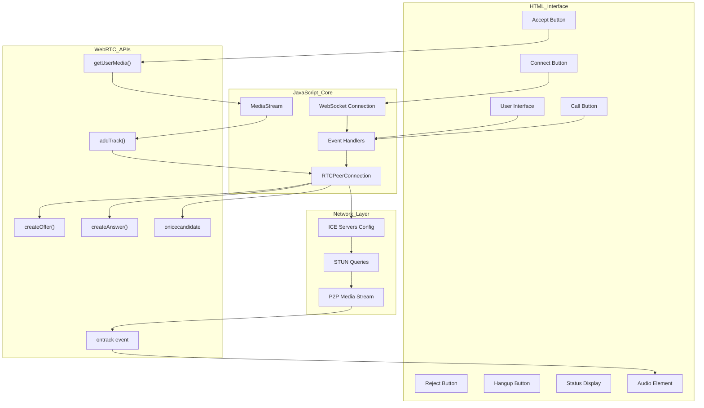
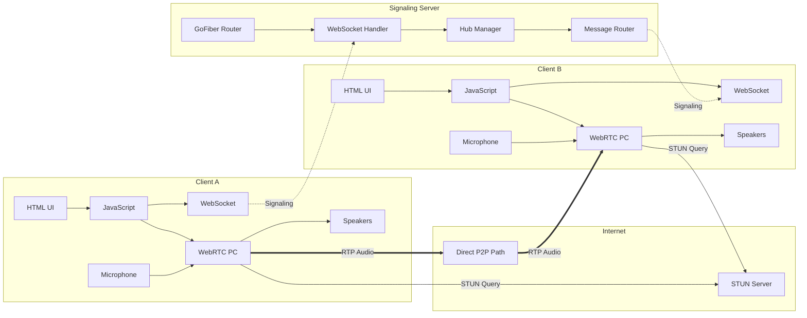
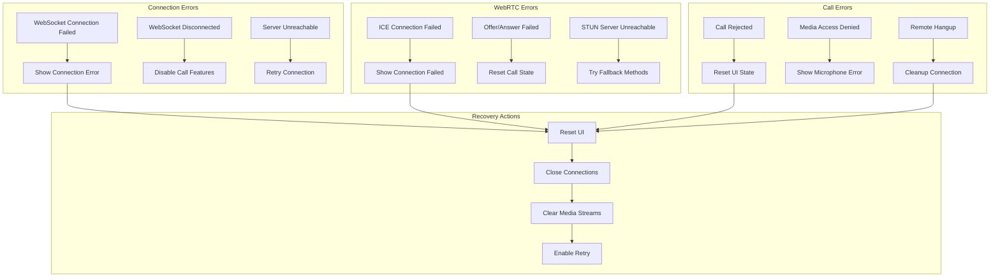

# WebRTC P2P Calling System - Mermaid Diagrams

## 1. System Architecture Overview

## **2. Complete Call Flow Sequence**

```mermaid
sequenceDiagram
    participant CA as Client A
    participant S as GoFiber Server
    participant CB as Client B
    participant STUN as STUN Server

    Note over CA, CB: Phase 1: Connection Setup
    CA->>S: WebSocket Connect (/ws?id=a)
    S->>S: Register Client A
    CB->>S: WebSocket Connect (/ws?id=b)
    S->>S: Register Client B

    Note over CA, CB: Phase 2: Call Initiation
    CA->>S: call-request → Client B
    S->>CB: Forward call-request from A
    CB->>CB: Show incoming call UI

    alt Call Accepted
        CB->>S: call-accept → Client A
        S->>CA: Forward call-accept from B
        CB->>CB: Get microphone access
    else Call Rejected
        CB->>S: call-reject → Client A
        S->>CA: Forward call-reject from B
        CA->>CA: Reset call UI
        Note over CA, CB: Call ends here if rejected
    end

    Note over CA, CB: Phase 3: WebRTC Setup
    CA->>S: GET /ice-servers
    S-->>CA: [STUN server config]
    CB->>S: GET /ice-servers
    S-->>CB: [STUN server config]

    par ICE Discovery
        CA->>STUN: Discover public IP
        STUN-->>CA: Public IP: 203.0.113.45
    and
        CB->>STUN: Discover public IP
        STUN-->>CB: Public IP: 198.51.100.33
    end

    Note over CA, CB: Phase 4: SDP Exchange
    CA->>CA: Create RTCPeerConnection
    CA->>CA: Create SDP Offer
    CA->>S: offer → Client B
    S->>CB: Forward SDP offer from A

    CB->>CB: Create RTCPeerConnection
    CB->>CB: Set remote description (offer)
    CB->>CB: Create SDP Answer
    CB->>S: answer → Client A
    S->>CA: Forward SDP answer from B
    CA->>CA: Set remote description (answer)

    Note over CA, CB: Phase 5: ICE Candidate Exchange
    par ICE Candidates Exchange
        CA->>S: candidate → Client B
        S->>CB: Forward ICE candidate from A
        CB->>CB: Add ICE candidate
    and
        CB->>S: candidate → Client A
        S->>CA: Forward ICE candidate from B
        CA->>CA: Add ICE candidate
    end

    Note over CA, CB: Phase 6: Direct P2P Connection
    CA->>CB: ICE connectivity checks
    CB->>CA: ICE connectivity checks
    CA->>CB: DTLS handshake (encryption)
    CB->>CA: DTLS handshake (encryption)
    CA->>CB: Direct RTP Audio Stream
    CB->>CA: Direct RTP Audio Stream

    Note over CA, CB: Phase 7: Active Call
    CA->>CB: Audio Stream
    CB->>CA: Audio Stream
    Note over S: Server no longer involved in media

    Note over CA, CB: Phase 8: Call Termination
    alt Hang up by Client A
        CA->>S: hangup → Client B
        S->>CB: Forward hangup from A
        CB->>CB: Close connection & cleanup
    else Hang up by Client B
        CB->>S: hangup → Client A
        S->>CA: Forward hangup from B
        CA->>CA: Close connection & cleanup
    end

    CA->>CA: Reset UI
    CB->>CB: Reset UI
```

## **3. WebSocket Message Flow**

## **4. WebRTC Peer Connection State Machine**

## **5. Server Architecture Components**

## **6. Client-Side Component Flow**

## **7. Data Flow Architecture**

## **8. Error Handling Flow**

