# WebRTC P2P Calling System - Mermaid Diagrams

## 1. System Architecture Overview

```mermaid
graph TB
    subgraph "Client Side"
        A[Client A Browser<br/>callerA.html<br/>clientId: "a"]
        B[Client B Browser<br/>callerB.html<br/>clientId: "b"]
        D[Diagnostics Page<br/>diagnostics.html<br/>ICE Testing]
    end
    
    subgraph "GoFiber Server :8080"
        S[GoFiber HTTP Server]
        WS[WebSocket Handler<br/>/ws?id=clientId]
        H[Hub - Client Manager<br/>Register/Unregister<br/>map[string]*Client]
        R[Message Router<br/>Forward signaling<br/>Sets msg.From automatically]
        ICE[ICE Servers Endpoint<br/>/ice-servers<br/>Returns STUN + TURN config]
        SF[Static Files Handler<br/>/, /callerA.html, /callerB.html<br/>/diagnostics.html]
    end
    
    subgraph "Docker Services"
        TURN[Coturn TURN Server<br/>localhost:3478<br/>testuser:testpass]
    end
    
    subgraph "External Services"
        STUN1[Google STUN<br/>stun.l.google.com:19302]
        STUN2[Google STUN Backup<br/>stun1.l.google.com:19302]
    end
    
    A -.->|WebSocket ws://host/ws?id=a| WS
    B -.->|WebSocket ws://host/ws?id=b| WS
    D -->|HTTP GET /ice-servers| ICE
    WS --> H
    H --> R
    
    A -->|GET /ice-servers| ICE
    B -->|GET /ice-servers| ICE
    
    A -->|GET /callerA.html| SF
    B -->|GET /callerB.html| SF
    D -->|GET /diagnostics.html| SF
    
    A -.->|STUN/TURN Requests| STUN1
    A -.->|STUN/TURN Requests| STUN2
    A -.->|TURN Relay if needed| TURN
    B -.->|STUN/TURN Requests| STUN1
    B -.->|STUN/TURN Requests| STUN2
    B -.->|TURN Relay if needed| TURN
    
    A ==>|Direct P2P RTP Audio<br/>or via TURN if NAT fails| B
```

## **2. Complete Call Flow Sequence**

```mermaid
sequenceDiagram
    participant CA as Client A (clientId: "a")
    participant S as GoFiber Server
    participant CB as Client B (clientId: "b")
    participant STUN as STUN Servers
    participant TURN as TURN Server (Docker)

    Note over CA, CB: Phase 1: Connection Setup & Permissions
    CA->>CA: Check microphone permissions
    CA->>S: WebSocket Connect (/ws?id=a)
    S->>S: Register Client A in Hub
    CB->>CB: Check microphone permissions
    CB->>S: WebSocket Connect (/ws?id=b)
    S->>S: Register Client B in Hub

    Note over CA, CB: Phase 2: Call Initiation
    CA->>S: call-request → Client B (msg.From set by server)
    S->>CB: Forward call-request from A
    CB->>CB: Show incoming call UI with accept/reject buttons

    alt Call Accepted
        CB->>CB: getUserMedia() - Get microphone access
        CB->>S: call-accept → Client A
        S->>CA: Forward call-accept from B
        CA->>CA: Enable hangup/mute buttons
        CA->>CA: updateCallState("Call accepted, connecting...")
    else Call Rejected
        CB->>S: call-reject → Client A
        S->>CA: Forward call-reject from B
        CA->>CA: updateCallState("Call rejected")
        CA->>CA: resetCallUI()
        Note over CA, CB: Call ends here if rejected
    end

    Note over CA, CB: Phase 3: WebRTC Setup & ICE Configuration
    CA->>S: GET /ice-servers
    S-->>CA: [STUN servers + TURN server config]
    CB->>S: GET /ice-servers
    S-->>CB: [STUN servers + TURN server config]

    par ICE Discovery
        CA->>STUN: Discover public IP via multiple STUN servers
        CA->>TURN: Test TURN server connectivity
        STUN-->>CA: Public IP candidates
        TURN-->>CA: TURN relay candidates
    and
        CB->>STUN: Discover public IP via multiple STUN servers
        CB->>TURN: Test TURN server connectivity
        STUN-->>CB: Public IP candidates
        TURN-->>CB: TURN relay candidates
    end

    Note over CA, CB: Phase 4: SDP Exchange (Offer/Answer)
    CA->>CA: createPeerConnection() with STUN/TURN servers
    CA->>CA: addTrack(localStream) - Add microphone
    CA->>CA: createOffer()
    CA->>S: offer → Client B
    S->>CB: Forward SDP offer from A (msg.From="a")

    CB->>CB: createPeerConnection() with STUN/TURN servers
    CB->>CB: setRemoteDescription(offer)
    CB->>CB: addTrack(localStream) - Add microphone
    CB->>CB: createAnswer()
    CB->>S: answer → Client A
    S->>CA: Forward SDP answer from B (msg.From="b")
    CA->>CA: setRemoteDescription(answer)

    Note over CA, CB: Phase 5: ICE Candidate Exchange with Queueing
    par ICE Candidates Exchange with Smart Queueing
        CA->>S: candidate → Client B
        S->>CB: Forward ICE candidate from A (msg.From="a")
        alt Remote Description Set
            CB->>CB: addIceCandidate() immediately
        else Remote Description Not Set
            CB->>CB: Queue in pendingIceCandidates[]
            Note over CB: Process queue after setRemoteDescription()
        end
    and
        CB->>S: candidate → Client A
        S->>CA: Forward ICE candidate from B (msg.From="b")
        alt Remote Description Set
            CA->>CA: addIceCandidate() immediately
        else Remote Description Not Set
            CA->>CA: Queue in pendingIceCandidates[]
            Note over CA: Process queue after setRemoteDescription()
        end
    end

    Note over CA, CB: Phase 6: Connection Establishment
    alt Direct P2P Possible
        CA->>CB: ICE connectivity checks (direct path)
        CB->>CA: ICE connectivity checks (direct path)
        CA->>CB: DTLS handshake for encryption
        CB->>CA: DTLS handshake for encryption
        Note over CA, CB: Direct P2P connection established
    else NAT/Firewall Blocks Direct Connection
        CA->>TURN: Relay connection via TURN server
        CB->>TURN: Relay connection via TURN server
        TURN->>TURN: Relay media between CA and CB
        Note over CA, CB: TURN relay connection established
    end

    Note over CA, CB: Phase 7: Active Call with Features
    CA->>CB: Audio Stream (RTP/SRTP)
    CB->>CA: Audio Stream (RTP/SRTP)
    Note over S: Server no longer involved in media

    opt Mute/Unmute Feature
        CA->>CA: toggleMute() - mute/unmute microphone
        Note over CA: Audio track enabled/disabled locally
    end

    Note over CA, CB: Phase 8: Call Termination
    alt Hang up by Client A
        CA->>CA: Close peer connection & cleanup streams
        CA->>S: hangup → Client B
        S->>CB: Forward hangup from A
        CB->>CB: handleRemoteHangup() & cleanup
    else Hang up by Client B
        CB->>CB: Close peer connection & cleanup streams
        CB->>S: hangup → Client A
        S->>CA: Forward hangup from B
        CA->>CA: handleRemoteHangup() & cleanup
    end

    CA->>CA: resetCallUI() - Enable connect/call buttons
    CB->>CB: resetCallUI() - Reset UI state
```



## **3. WebSocket Message Flow & Hub Routing**

```mermaid
graph TD
    subgraph "Message Types & Data Structure"
        CR[call-request<br/>Initiate call<br/>data: null]
        CA[call-accept<br/>Accept call<br/>data: null]
        CRJ[call-reject<br/>Reject call<br/>data: null]
        O[offer<br/>SDP offer<br/>data: RTCSessionDescription]
        A[answer<br/>SDP answer<br/>data: RTCSessionDescription]
        IC[candidate<br/>ICE candidate<br/>data: RTCIceCandidate]
        H[hangup<br/>End call<br/>data: null]
    end

    subgraph "Client A Flow (clientId: 'a')"
        A1[Click Call Button] --> A2[Send call-request to 'b']
        A3[Receive call-accept] --> A4[initiateWebRTCCall()]
        A4 --> A5[Send offer to 'b']
        A6[Receive answer] --> A7[setRemoteDescription]
        A7 --> A8[Send ICE candidates]
        A9[Click Hangup] --> A10[Send hangup to 'b']
    end

    subgraph "Client B Flow (clientId: 'b')"
        B1[Receive call-request] --> B2[Show Accept/Reject UI]
        B3[Click Accept] --> B4[getUserMedia() + Send call-accept to 'a']
        B5[Receive offer] --> B6[setRemoteDescription + createAnswer]
        B6 --> B7[Send answer to 'a']
        B8[Send/Receive ICE candidates] --> B9[P2P Connected]
        B10[Receive hangup] --> B11[handleRemoteHangup()]
    end

    subgraph "GoFiber Server Hub Processing"
        S1[WebSocket.onmessage] --> S2[JSON.parse SignalingMessage]
        S2 --> S3[Set msg.From = clientID automatically]
        S3 --> S4{Route to msg.To client}
        S4 --> S5[hub.SendToClient(msg.To, msgBytes)]
        S5 --> S6[Forward via WebSocket to target client]
        
        subgraph "Hub State Management"
            H1[Hub.Clients: map[string]*Client]
            H2[Hub.Register channel]
            H3[Hub.Unregister channel]
            H4[Client.ID, Client.Conn, Client.Hub]
        end
    end

    A2 --> S1
    A5 --> S1
    A8 --> S1
    A10 --> S1
    S6 --> B1
    S6 --> B5
    S6 --> B10

    B4 --> S1
    B7 --> S1
    B8 --> S1
    S6 --> A3
    S6 --> A6

    H1 -.-> S4
    H2 -.-> H1
    H3 -.-> H1
```

## **4. WebRTC Peer Connection State Machine with ICE Handling**


## **5. Server Architecture Components**


## **6. Client-Side Component Flow & Features**

```mermaid
graph TD
    subgraph HTML_Interface
        UI["User Interface Elements"]
        ConnectBtn["Connect Button"]
        CallBtn["Call Button"]
        AcceptBtn["Accept Button<br/>(in incoming call UI)"]
        RejectBtn["Reject Button<br/>(in incoming call UI)"]
        HangupBtn["Hang Up Button"]
        MuteBtn["🎤 Mute Button<br/>Toggle microphone"]
        Status["Status Display<br/>Connection state"]
        CallState["Call State Display<br/>Call progress"]
        Audio["Audio Element<br/>remoteAudio autoplay"]
        IncomingCallDiv["Incoming Call Notification<br/>Shows caller name"]
    end

    subgraph JavaScript_Core
        WS["WebSocket Connection<br/>ws://host/ws?id=clientId"]
        PC["RTCPeerConnection<br/>with STUN/TURN servers"]
        LocalStream["MediaStream<br/>from getUserMedia()"]
        RemoteStream["Remote MediaStream<br/>from ontrack event"]
        Handlers["Event Handlers<br/>WebSocket & WebRTC events"]
        PermissionCheck["checkMicrophonePermission()<br/>Early permission request"]
        ICEQueue["pendingIceCandidates[]<br/>Queue for early candidates"]
    end

    subgraph WebRTC_APIs
        GetUserMedia["navigator.mediaDevices<br/>.getUserMedia({audio: true})"]
        CreateOffer["pc.createOffer()"]
        CreateAnswer["pc.createAnswer()"]
        AddTrack["pc.addTrack(track, localStream)"]
        OnTrack["pc.ontrack = handleRemoteStream"]
        OnICE["pc.onicecandidate = handleCandidate"]
        SetLocalDesc["pc.setLocalDescription()"]
        SetRemoteDesc["pc.setRemoteDescription()"]
        AddICECandidate["pc.addIceCandidate()<br/>with smart queueing"]
    end

    subgraph Network_Layer
        ICEServers["GET /ice-servers<br/>Fetch STUN/TURN config"]
        STUNQuery["STUN Connectivity Checks<br/>Multiple servers for redundancy"]
        TURNRelay["TURN Server Relay<br/>Fallback for NAT traversal"]
        P2PMedia["Direct P2P Media Stream<br/>or via TURN relay"]
        WSSignaling["WebSocket Signaling<br/>call-*, offer, answer, candidate"]
    end

    subgraph Client_Specific_Behavior
        ClientA["Client A (clientId: 'a')<br/>Initiates calls to 'b'"]
        ClientB["Client B (clientId: 'b')<br/>Receives calls from 'a'"]
        HostDetection["Dynamic Host Detection<br/>window.location.host"]
        ProtocolDetection["Protocol Detection<br/>ws:// vs wss://"]
    end

    UI --> Handlers
    ConnectBtn --> PermissionCheck
    PermissionCheck --> WS
    CallBtn --> Handlers
    AcceptBtn --> GetUserMedia
    MuteBtn --> LocalStream
    
    GetUserMedia --> LocalStream
    LocalStream --> AddTrack
    AddTrack --> PC
    PC --> CreateOffer
    PC --> CreateAnswer
    PC --> OnICE
    OnTrack --> RemoteStream
    RemoteStream --> Audio

    WS --> Handlers
    Handlers --> PC
    PC --> ICEServers
    ICEServers --> STUNQuery
    ICEServers --> TURNRelay
    STUNQuery --> P2PMedia
    TURNRelay --> P2PMedia
    P2PMedia --> OnTrack

    OnICE --> ICEQueue
    ICEQueue --> AddICECandidate
    SetRemoteDesc --> AddICECandidate

    ClientA -.-> UI
    ClientB -.-> UI
    HostDetection -.-> WS
    ProtocolDetection -.-> WS
```



## **7. Data Flow Architecture with TURN Support**

```mermaid
flowchart LR
    subgraph "Client A (ID: 'a')"
        A1[HTML UI<br/>callerA.html] --> A2[JavaScript Engine]
        A2 --> A3[WebSocket Connection<br/>ws://host/ws?id=a]
        A2 --> A4[WebRTC PeerConnection<br/>with STUN/TURN config]
        A5[Microphone<br/>getUserMedia()] --> A4
        A4 --> A6[Speakers<br/>remoteAudio element]
        A7[Mute Button] -.-> A4
    end

    subgraph "Signaling Server (:8080)"
        S1[GoFiber HTTP Server] --> S2[WebSocket Handler /ws]
        S2 --> S3[Hub Manager<br/>Client Registry]
        S3 --> S4[Message Router<br/>Auto-set msg.From]
        S5[Static File Server<br/>HTML/JS delivery]
        S6[ICE Servers API<br/>/ice-servers endpoint]
    end

    subgraph "Client B (ID: 'b')"
        B1[HTML UI<br/>callerB.html] --> B2[JavaScript Engine]
        B2 --> B3[WebSocket Connection<br/>ws://host/ws?id=b]
        B2 --> B4[WebRTC PeerConnection<br/>with STUN/TURN config]
        B5[Microphone<br/>getUserMedia()] --> B4
        B4 --> B6[Speakers<br/>remoteAudio element]
        B7[Accept/Reject UI] -.-> B2
    end

    subgraph "External Services"
        I1[STUN Servers<br/>Google: stun.l.google.com<br/>stun1.l.google.com]
        I2[TURN Server<br/>Docker Coturn<br/>localhost:3478<br/>testuser:testpass]
        I3[Direct P2P Path<br/>If NAT allows]
        I4[TURN Relay Path<br/>If direct fails]
    end

    subgraph "Diagnostics"
        D1[diagnostics.html<br/>ICE connectivity testing]
        D1 --> S6
        D1 --> I1
        D1 --> I2
    end

    %% Signaling Flow
    A3 -.->|WebSocket Signaling<br/>call-*, offer, answer, candidate| S2
    S4 -.->|Forward messages<br/>with msg.From set| B3

    %% HTTP API calls
    A2 -->|GET /callerA.html| S5
    B2 -->|GET /callerB.html| S5
    A4 -->|GET /ice-servers| S6
    B4 -->|GET /ice-servers| S6

    %% ICE/STUN/TURN Discovery
    A4 -->|STUN Binding Requests| I1
    B4 -->|STUN Binding Requests| I1
    A4 -->|TURN Allocation Requests| I2
    B4 -->|TURN Allocation Requests| I2

    %% Media Flow (Alternative Paths)
    A4 ==>|RTP Audio (Direct P2P)<br/>If NAT allows| I3
    I3 ==>|Direct RTP| B4
    
    A4 -.->|RTP via TURN Relay<br/>If direct fails| I2
    I2 -.->|Relayed RTP| B4

    %% Styling
    classDef signaling stroke:#2196F3,stroke-width:2px,stroke-dasharray: 5 5
    classDef media stroke:#4CAF50,stroke-width:3px
    classDef relay stroke:#FF9800,stroke-width:2px,stroke-dasharray: 5 5
    
    class A3,B3,S2,S4 signaling
    class I3,A4,B4 media
    class I2,I4 relay
```

## **8. Error Handling & Recovery Flow**

```mermaid
graph TD
    subgraph "Connection Errors"
        CE1[WebSocket Connection Failed<br/>ws.onerror] --> CE2[Show 'Connection error'<br/>updateStatus()]
        CE3[WebSocket Disconnected<br/>ws.onclose] --> CE4[Disable call features<br/>Reset button states]
        CE5[Server Unreachable<br/>Cannot connect to :8080] --> CE6[Alert user<br/>Check server status]
        CE7[Invalid Client ID<br/>Missing ?id= parameter] --> CE8[Server closes connection<br/>Log error]
    end

    subgraph "Permission & Media Errors"
        PE1[Microphone Permission Denied<br/>NotAllowedError] --> PE2[Alert user<br/>Guide to browser settings]
        PE3[Microphone Not Available<br/>NotFoundError] --> PE4[Show hardware error<br/>Check device]
        PE5[getUserMedia() Failed<br/>Various MediaStreamErrors] --> PE6[Handle gracefully<br/>Show specific error]
        PE7[Early Permission Check Failed<br/>checkMicrophonePermission()] --> PE8[Prevent WebSocket connection<br/>Don't proceed]
    end

    subgraph "Call Errors"
        CAE1[Call Rejected by Remote<br/>call-reject message] --> CAE2[updateCallState('Call rejected')<br/>resetCallUI()]
        CAE3[Call Timeout<br/>No response to call-request] --> CAE4[Auto-cancel call<br/>Reset UI state]
        CAE5[Remote Hangup<br/>hangup message] --> CAE6[handleRemoteHangup()<br/>Cleanup connections]
        CAE7[Target Client Not Found<br/>Server can't route message] --> CAE8[Log 'Client not found'<br/>Server-side error]
    end

    subgraph "WebRTC Errors"
        WE1[ICE Connection Failed<br/>pc.iceConnectionState = 'failed'] --> WE2[Try TURN relay<br/>Fallback mechanism]
        WE2 --> WE21[TURN Also Fails] --> WE22[Show 'Connection failed'<br/>Suggest network check]
        WE3[Offer/Answer Failed<br/>SDP negotiation error] --> WE4[Log detailed error<br/>resetCallUI()]
        WE5[STUN Server Unreachable<br/>Network connectivity issue] --> WE6[Try alternative STUN<br/>stun1.l.google.com backup]
        WE7[addIceCandidate Failed<br/>Invalid candidate or timing] --> WE8[Use pendingIceCandidates queue<br/>Retry after remote description]
        WE9[MediaStream Lost<br/>Track ended unexpectedly] --> WE10[Notify user<br/>Attempt to restart media]
    end

    subgraph "Recovery Actions"
        RA1[resetCallUI()<br/>Enable connect/call buttons] --> RA2[pc.close()<br/>Clean up peer connection]
        RA2 --> RA3[localStream.getTracks()<br/>.forEach(track => track.stop())]
        RA3 --> RA4[Clear UI states<br/>Hide incoming call div]
        RA4 --> RA5[updateStatus('Ready for new call')<br/>updateCallState('No Call')]

        RA6[Automatic Reconnection<br/>For WebSocket drops] --> RA7[Implement exponential backoff<br/>Retry connection]
        RA8[Graceful Degradation<br/>Disable advanced features] --> RA9[Show basic error UI<br/>Maintain core functionality]
    end

    subgraph "User Guidance"
        UG1[Microphone Permission Dialog<br/>Browser-specific instructions]
        UG2[Network Connectivity Help<br/>Firewall/NAT guidance]
        UG3[Browser Compatibility Check<br/>WebRTC support detection]
        UG4[Diagnostics Page Link<br/>diagnostics.html for testing]
    end

    %% Error to Recovery Flows
    CE2 --> RA6
    CE4 --> RA1
    PE2 --> UG1
    PE4 --> UG3
    CAE2 --> RA1
    CAE6 --> RA1
    WE4 --> RA1
    WE22 --> UG2

    %% Advanced Error Handling
    PE1 --> PE7
    WE1 --> WE2
    WE7 --> WE8
    CE3 --> RA6

    %% User Support
    UG4 -.-> WE22
    UG2 -.-> WE6
    UG3 -.-> PE4
```

## **9. Docker Infrastructure & TURN Server Setup**


## **10. Diagnostics & Testing Infrastructure**

```mermaid
graph TD
    subgraph "Diagnostics Page (diagnostics.html)"
        DiagUI["🔧 WebRTC ICE Diagnostics<br/>Dedicated testing interface"]
        TestBtn["🧪 Run ICE Test Button"]
        ClearBtn["🗑️ Clear Results Button"]
        ResultsDiv["Results Display Area<br/>Color-coded status messages"]
    end
    
    subgraph "Test Categories"
        Success["✅ Success Status<br/>Green background<br/>Connection working"]
        Warning["⚠️ Warning Status<br/>Yellow background<br/>Partial functionality"]
        Error["❌ Error Status<br/>Red background<br/>Connection failed"]
        Info["ℹ️ Info Status<br/>Blue background<br/>Informational messages"]
    end
    
    subgraph "Test Functions"
        ICETest["ICE Connectivity Test<br/>Create RTCPeerConnection<br/>Test ICE gathering"]
        STUNTest["STUN Server Test<br/>Check reachability<br/>Public IP discovery"]
        TURNTest["TURN Server Test<br/>Authentication check<br/>Relay functionality"]
        MediaTest["Media Device Test<br/>Microphone access<br/>Audio capabilities"]
    end
    
    subgraph "Test Results & Analysis"
        CandidateAnalysis["ICE Candidate Analysis<br/>Host, srflx, relay candidates<br/>Network topology detection"]
        LatencyMeasurement["Connection Latency<br/>RTT measurements<br/>Quality assessment"]
        FailureAnalysis["Failure Root Cause<br/>Detailed error reporting<br/>Troubleshooting guidance"]
        NetworkTopology["Network Environment<br/>NAT type detection<br/>Firewall analysis"]
    end
    
    subgraph "Integration with Main App"
        SharedConfig["Shared ICE Configuration<br/>Same /ice-servers endpoint<br/>Consistent STUN/TURN setup"]
        DebugMode["Debug Information<br/>Detailed logging<br/>Connection state tracking"]
        UserGuidance["User Support<br/>Link from error states<br/>Self-service diagnostics"]
    end

    DiagUI --> TestBtn
    TestBtn --> ICETest
    ICETest --> STUNTest
    STUNTest --> TURNTest
    TURNTest --> MediaTest
    
    MediaTest --> CandidateAnalysis
    CandidateAnalysis --> LatencyMeasurement
    LatencyMeasurement --> FailureAnalysis
    FailureAnalysis --> NetworkTopology
    
    NetworkTopology --> Success
    NetworkTopology --> Warning  
    NetworkTopology --> Error
    NetworkTopology --> Info
    
    Success --> ResultsDiv
    Warning --> ResultsDiv
    Error --> ResultsDiv
    Info --> ResultsDiv
    
    DiagUI --> SharedConfig
    SharedConfig --> DebugMode
    DebugMode --> UserGuidance
    
    ClearBtn --> ResultsDiv
```

